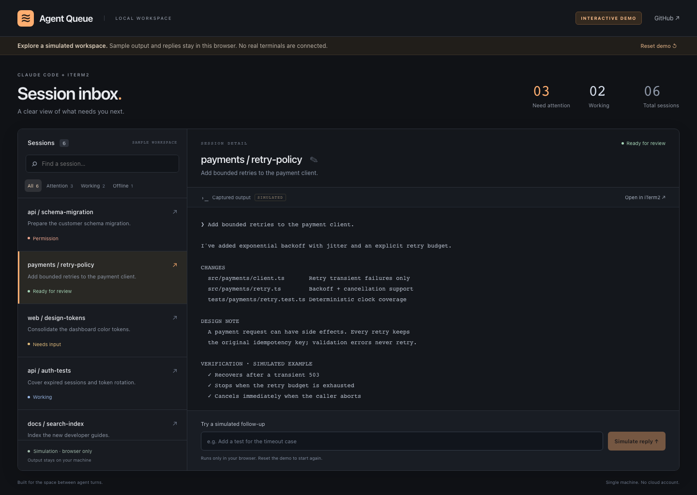
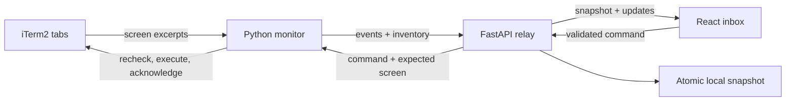

<div align="center">

# Agent Queue

**An inbox for your coding agents.**

See which Claude Code sessions need you, read their output, and send the next step — from one local workspace.

[Try the demo](#try-it-without-iterm2) · [Run locally](#connect-your-iterm2-sessions) · [Architecture](docs/architecture.md) · [Contributing](CONTRIBUTING.md)

</div>



*Actual application screenshot in demo mode. Session names, terminal output, and verification lines are synthetic examples.*

## Keep the work moving

When several agents are running in separate tabs, checking each one becomes a task of its own. Agent Queue makes the handoff visible:

- **One inbox.** Search sessions and filter attention, active work, or unavailable terminals.
- **Context before action.** Read a captured terminal excerpt and the latest detected prompt.
- **Honest delivery.** A reply succeeds only when the monitor acknowledges that iTerm2 accepted it. Disconnections and uncertain outcomes stay visible.
- **Reconnect with context.** Session snapshots survive backend restarts. Restored sessions remain unavailable until the monitor observes them again.
- **Local by design.** No account, cloud relay, model API key, or external database.

Live monitoring currently supports **Claude Code in iTerm2 on macOS**. It infers state from terminal text; it is not a Claude Code protocol integration or a general agent orchestration platform.

## Try it without iTerm2

Requires Node.js **22.12+** (Node 24 recommended). This builds and serves a browser-only simulation; Python, macOS, API keys, and real agents are not required.

```bash
git clone https://github.com/ichen27/agent-queue.git
cd agent-queue/dashboard
npm ci
npm run demo
```

Open **[http://127.0.0.1:7891/?demo=1](http://127.0.0.1:7891/?demo=1)**.

Select a session, filter the inbox, simulate a follow-up, or rename a sample session. **Reset demo** restores the examples. The persistent demo banner distinguishes simulated output from real activity. Demo mode opens no WebSockets, calls no backend APIs, and cannot send terminal commands.

[Watch the captured demo walkthrough](docs/media/agent-queue-demo.webm) · [Mobile screenshot](docs/media/agent-queue-mobile.png)

> This repository was previously named `ai-coding-queue`. Existing GitHub links redirect to `agent-queue` after the repository rename.

## Connect your iTerm2 sessions

Requirements: macOS, iTerm2 with its Python API enabled, Claude Code, Python **3.12+**, and Node **22.12+**.

1. In iTerm2, enable **Settings → General → Magic → Enable Python API**. Allow the local Python script when iTerm2 asks.
2. Install and build from the repository root:

```bash
python3 -m venv .venv
.venv/bin/python -m pip install -r monitor/requirements.txt
npm --prefix dashboard ci
npm --prefix dashboard run build
```

3. Start the local backend and monitor:

```bash
./scripts/start.sh
```

Open **[http://127.0.0.1:7890](http://127.0.0.1:7890)**, then start Claude Code in your iTerm2 tabs. The monitor polls every two seconds. Press **Ctrl-C** in the launch terminal to stop the processes this script started. Nothing is installed into AutoLaunch or system services.

When a session is ready, review its current output and send a single-line follow-up. **Open in iTerm2** focuses the actual tab. Permission requests must be reviewed in the terminal; Agent Queue does not guess which approval key is safe.

### Storage and connection behavior

The launch script saves bounded snapshots to `.agent-queue/state.json` with owner-only file permissions. This includes captured terminal output, which may contain sensitive project content. The directory is excluded from Git. Set `AGENT_QUEUE_STATE` to use another local path; without that variable, directly starting the backend uses memory only.

A session becomes unavailable when removed from the monitor inventory, when the monitor disconnects, or after 15 seconds without a fresh observation. Its last output remains readable. Reconnection refreshes session state; **commands are never retried automatically**.

If delivery is reported as unknown, check the terminal before retrying. A terminal operation may have happened before its acknowledgement was lost.

## How it fits together



The monitor detects screen patterns, the relay owns freshness and delivery, and the dashboard presents state. The demo replaces the live connection entirely with an in-browser adapter. [Read the decisions and protocol](docs/architecture.md).

## Development

```bash
.venv/bin/python -m pip install -r requirements-dev.txt
.venv/bin/python -m pytest tests -q
npm --prefix dashboard run lint
npm --prefix dashboard run build

cd dashboard
npx playwright install chromium
npm run test:e2e
```

Python tests cover state detection, snapshot restoration, stale sessions, changed-screen rejection, acknowledged delivery, disconnects, origin checks, and real WebSocket flows. Browser tests cover desktop/mobile interactions and prove that demo interactions produce no backend or WebSocket traffic. CI runs Python 3.12/3.14 and the frontend/browser checks.

For frontend changes, `cd dashboard && npm run dev` serves Vite on port 5173; append `?demo=1` for simulated data. Its proxy connects live mode to a separately running backend on port 7890. See [CONTRIBUTING.md](CONTRIBUTING.md) for the local testing workflow.

## Current boundaries

- Screen parsing is heuristic and may need updates when Claude Code changes its terminal interface. Review the terminal when a state looks wrong.
- Captures contain at most 200 terminal lines. They are excerpts, not a complete conversation archive.
- Live text delivery requires an unchanged screen a current empty Claude prompt, and iTerm2 reporting the foreground job as `claude`. Unknown/wrapper names (including generic `node`) fail closed and require a manual reply. A UI that differs from recognized patterns may need a manual reply in iTerm2.
- An acknowledgement means iTerm2 accepted an operation, not that the agent completed the request. A small race remains between reading the screen and typing.
- One backend process and one monitor are supported. No hosted multi-user mode, remote auth, arbitrary shell execution, or automatic permission approval.
- Keep the backend bound to loopback. Host/origin checks are not a substitute for authentication on a public deployment.
- Restored state is capped at 100 sessions and 500 queue items. It does not persist pending commands.

See [troubleshooting and limitations](docs/operations.md) for recovery steps.

MIT · Built by [Ivan Chen](https://github.com/ichen27)
